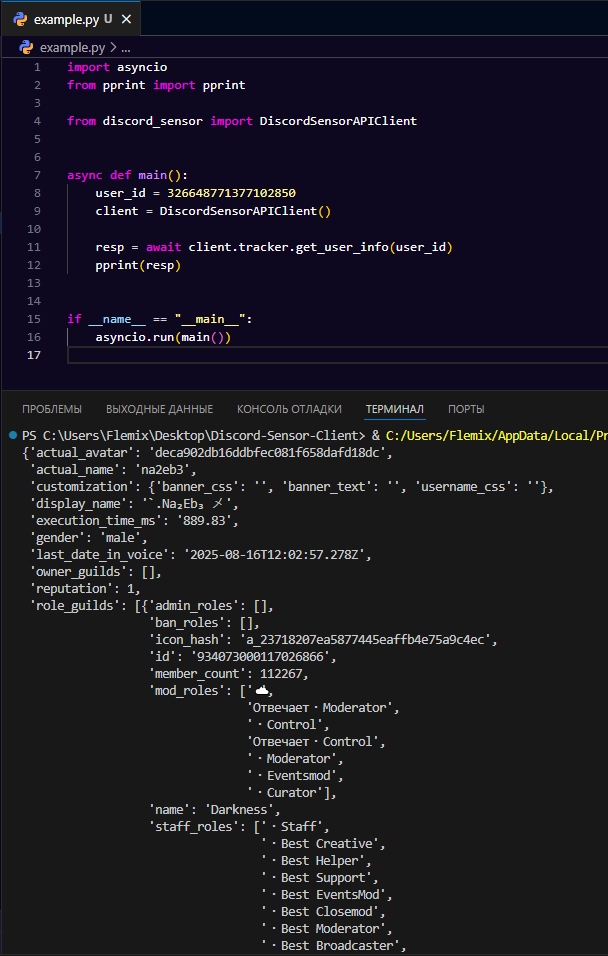

# Discord-Sensor-Client
API клиент для discord-sensor.com
Некоторые методы из Discord Sensor были изменены для удобства пользователей.  
Методы нашёл не все, но те что нашёл - сделал))  

Если проект наберёт хоть какую-то популярность, то я буду его дорабатывать и дополнять методы
Проект делался чисто из интереса и написан за 2 часа для набора опыта прошу строго не судить

# Использование (example.py)

# Просто для внимания
В этом проекте впервые использовал niquests, что могу сказать мне очень понравилось. Работает очень хорошо, а главное - быстро))  
Думаю aiohttp постепенно буду заменять как раз таки на niquests  

Создатели discord-sensor если вы это читаете я вас люблю xd)
